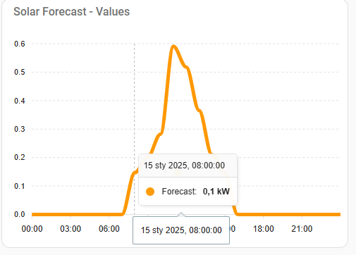

# Solar_Forecast_24H
# Table of Content
- [Introduction](#Introduction)
- [Instalation](#Instalation)
- [Configuration(Optional)](#Configuration)
- [Automation](#Automation)
- [Important notes](#Important-notes)

# Introduction


Home Assistant Extension to forecast PV electricity production the next day.
It allows us to easily check the predicted production of our photovoltaic panels.
****

# Instalation
In order for the charts to function correctly, the components listed need to be downloaded:
- UI Lovelace Minimalist
- apexchart-card

These components can be downloaded via [HACS]("https://hacs.xyz")
In addition, the Terminal & SSH add-on must be downloaded.

**Steps to be taken during installation:**
- Add project folder to /homeassistant folder,
- Open Terminal
- sudo apt install dos2unix
- cd /homeassistant/SolarForecast_24H
- dos2unix forecast_setup.sh
- dos2unix run_forecast.sh
- run forecast_setup.sh
- run run_forecast.sh

Installation may take some time depending on the resources available to Home Assistant.
****
# Configuration
**Step 1. Add .env file to project folder**

.env file is neccessary for the integration to work properly.
.env must contain 5 elements:
```
LATITUDE = xx.xx # Longitude of the solar instalation 
LONGITUDE = xx.xx # Latitude of the solar instalation
POWER = x.xx # Power of the solar instalation
HA_URL = http://homeassistant.local:8123 URL to connect with Home Assistant
HA_TOKEN = xxxxxxxxxxxxxxxx # Token to communicate with Home Assistant (Profile>Security>Tokens)
```
**Step 2. Create SolarForecastAI.yaml**

The contents of the .yaml file that generates the dashboard for the chart can be found below. This file should be located in the /homeassistant folder.

**SolarForecastAI.yaml**
```
title: Solar Forecast Dashboard
views:
  - title: Solar Forecast
    path: solar_forecast
    badges: []
    cards:
      - type: custom:apexcharts-card
        header:
          title: Solar Forecast - Values
          show: true
        series:
          - entity: sensor.solarforecastai
            attribute: values
            type: line
            name: Forecast
            unit: kW
            show:
              legend_value: true
            data_generator: |
              const startOfDay = new Date().setHours(0, 0, 0, 0);
              return entity.attributes.values.map((val, index) => {
                const date = new Date(startOfDay);
                date.setHours(index);
                return [date.getTime(), val];
              });
        graph_span: 24h
        span:
            start: day
``` 
**Step 3. Configure Configuration.yaml**
In order for the integration to display in the HA client, the call SolarForecastAI.yaml must be added to the content of configuration.yaml.
```
shell_command:
  run_solar_forecast: bash run_forecast.sh

  
lovelace:
  mode: yaml
  resources:
  - url: /hacsfiles/mini-graph-card/mini-graph-card-bundle.js
    type: module
  - url: /hacsfiles/apexcharts-card/apexcharts-card.js
    type: module
  dashboards:
    solar-forecast-ai: 
      mode: yaml
      filename: SolarForecastAI.yaml
      title: Solar Forecast Dashboard
      icon: mdi:solar-power
      show_in_sidebar: true
```
# Automation
To automate the refreshing of forecasts with cronetab you need to:
- open terminal
- apk add openrc --no-cache
- apk add tini --no-cache
- cp -p run_forecast /etc/periodic/daily

****
# Important notes
- It is recommended that integration is used for installations up to 10kWp.
- Running the run_forecast.sh script can be automated via automation.yaml or by adding the script to crontab.
- In SolarForecastAI.yaml installation values can be added to compare forecasts with real production.

## License

[MIT](https://choosealicense.com/licenses/mit/)

